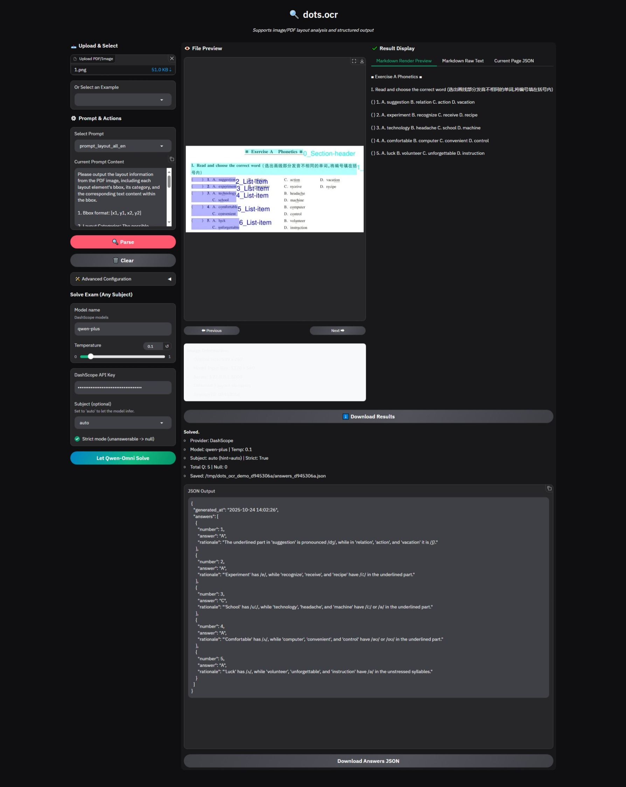

# [多模态教育-英语] - 功能测试报告

**版本:** v0.3（自测版）
**测试周期:** [2025-10-24] 至 [2025-10-24]
**报告日期:** [2025-10-24]
**测试人员:** [顾树昊]

---

## 1. 执行摘要

-   **核心结论:** 本次测试对 多模态AI教育-英语 的 主要测试功能，例如: 英语题目自动解答能力 进行了验证。共处理来自 七年级一课一练英语，week1单元 的 47 道题目，整体准确率为 **91%**。
-   **质量评估:** 测试结果显示，模型在理解类题目上的准确率较高，而语音类题目准确率稍弱。问题在于ocr无法识别下划线，导致分析有误。
-   **发布建议:** 建议在模型部署前，增加对下划线的识别能力，以提高语音类题目准确率。

## 2. 测试概览

| 项 | 说明 |
| :--- | :--- |
| **测试目标** | 评估AI模型在特定学科题目上的解答准确性、逻辑合理性及服务稳定性。 |
| **测试接口** | `POST http://172.16.6.237:8001/gradio_api/queue/join?` |
| **测试数据** | 七年级一课一练英语，week1单元，共47道题目 |
| **评估指标** | 1. **答案准确率** 2. **解析逻辑合理性** 3. **输出格式合规性** |
| **模型信息** | **Model_Name:** qwen-plus  **Temperature:** 0.1 |

## 3. 详细测试结果

### 3.1 分模块性能分析

| 学科/模块 | 题型描述 | 测试题量 | 通过题量 | 准确率 | 核心发现与问题摘要 |
| :--- | :--- | :--- | :--- | :--- | :--- |
| 总体pdf| 所有题型 | 47 | - | - | 多次测试均报错：超出长度限制 |
| 语音| **exercise_a:** 根据下划线部分区分特殊的读音 | 5 | 2 | 40% | ocr单词识别无误，但下划线无法识别。 模型基本可识别需要判断读音的部分，但是准确性一般 |
| 理解|  **exercise_b_1:** 结合语境写出单词的不同含义 | 5 | 5 | 100% | ocr识别准确，对于词义理解效果较好 |
| 理解|  **exercise_b_2:** 根据选项的英文释义，选择合适的句子进行填空 | 9 | 9 | 100% | ocr识别准确，词义理解效果很好 |
| 语音|  **exercise_b_3:** 写出给出单词音标相同的单词 | 20 | 19 | 95% | ocr识别准确，音标识别效果较好，但题目内容输出顺序混乱 |
| 理解|  **exercise_b_4:**  选词填空（段落） | 8 | 8 | 100% | ocr识别准确，词义理解效果很好 |
| 综合分题处理效果| 47道题目 | 47 | 43 | 91% | 模型在47道题目中，通过了43道，准确率为91%。主要在语音辨析类型上存在问题，需要进一步优化。 |

## 4. 问题诊断与根因分析

### 4.1 主要问题分类

| 问题类别 | 描述 | 对功能的影响 | 示例（可引用附录中的图号） |
| :--- | :--- | :--- | :--- |
| **OCR识别问题** | 无法正确识别单词部分字母的下划线。 | 导致语音题的音标判断部分错误 | 例如: exercise_a.jpeg，下划线未被识别。 |
| **系统集成问题** | 如输入文本过长导致处理失败。 | 阻塞性错误，使部分功能完全无法触发。 | 例如: 整页PDF输入时报错。 |

## 5. 结论与行动建议

### 5.1 测试结论
基于上述测试结果，多模态AI教育-英语 在当前版本的总体质量评估为 **91%**。其主要优势在于 理解类题目准确率较高，而语音类题目准确率稍弱，但问题应该在于ocr无法识别下划线导致分析有误。

### 5.2 优化建议与优先级
| 优先级 | 建议项 | 负责人（建议） | 期望效果 |
| :--- | :--- | :--- | :--- |
| **P0** | 优化OCR对下划线的识别准确率。 |  | 从源头保证输入信息的准确性。 |
| **P1** | 实现长文本题目自动分割功能，避免输入超长。 |  | 提升系统鲁棒性，改善用户体验。 |

## 6.截图
-   **图1:** 英语-pdf答题失效

-   **图2:** 英语- exercise_a

-   **图3:** 英语- exercise_b_1

-   **图4:** 英语- exercise_b_2

-   **图5:** 英语- exercise_b_3

-   **图6:** 英语- exercise_b_4

